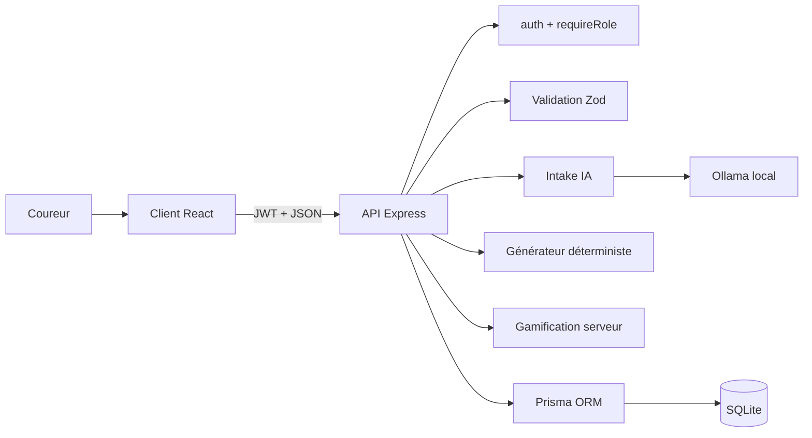

# Architecture — Running Club

> Documentation technique (Activité 4). Complète le [README](README.md) (installation, API) et
> le [modèle de données](docs/mcd-mld.md). Écrans et flux détaillés : [docs/wireframes.md](docs/wireframes.md).

## Objectif de l'architecture

Séparer clairement l'interface, la logique métier et les données, tout en gardant un projet
simple à lancer et à faire évoluer. Deux invariants structurants :

- **Le client ne calcule jamais** l'XP, les niveaux ni les prédictions — tout est fait côté serveur
  pour garantir la cohérence et limiter la triche.
- **L'IA est cantonnée à l'intake** (comprendre l'objectif exprimé en langage naturel). Le plan
  d'entraînement et les calculs sportifs sont **déterministes**, donc fiables, reproductibles et testables.

## Vue générale



## Rôle de chaque partie

### Client React
Affiche les pages (connexion, inscription, tableau de bord), le chat d'intake, la carte de
progression et les résultats. Il appelle l'API avec **TanStack Query** (gestion des états
`loading` / `success` / `error`) et n'accède jamais directement à la base.

### API Express
Reçoit les requêtes, vérifie le JWT et le rôle, valide les entrées (Zod), applique les règles
métier (plan, XP, prédiction) et communique avec la base via Prisma. Toutes les réponses sont en JSON.

### Prisma + SQLite
Prisma sert d'intermédiaire typé entre le serveur et SQLite. La base conserve les utilisateurs,
domaines, objectifs, tâches (séances), sessions et feedbacks. Le schéma évolue par **migrations**
nommées dans `server/prisma/migrations/`.

### Ollama
Utilisé **uniquement** pour interpréter l'objectif formulé par l'utilisateur et produire une
structure exploitable (objectif SMART). La sortie est validée par Zod avant toute utilisation ;
la génération du plan reste déterministe côté serveur.

## Flux principal (bout en bout)

1. Le coureur s'inscrit / se connecte → l'API renvoie un **JWT** (identifiant + rôle).
2. Il décrit son objectif → `POST /ai/objectifs/intake` : Ollama pose les questions manquantes
   (≤ 4) puis renvoie un objectif structuré, validé par Zod.
3. L'objectif est créé → `POST /domaines/:id/objectifs`, persisté par Prisma.
4. Le plan est généré → `POST /objectifs/:id/taches/generate` : `training-plan.js`
   (`generateTrainingPlan`) construit les séances de façon **déterministe** à partir du niveau,
   de la fréquence, de la VMA et du nombre de semaines.
5. Le coureur complète une séance → `POST /taches/:id/complete` : dans **une seule transaction**,
   le serveur crée la session, calcule l'XP (`gamification.js`), met à jour le niveau, recalcule
   la prédiction (Riegel, `predictTimeSeconds`) et recalibre les séances restantes
   (`recalibrateRemainingTasks`).
6. Quand toutes les séances sont faites → `PATCH /objectifs/:id/validate` : gros gain d'XP unique.
7. Le front récupère la progression (`GET /domaines/:id/progression`) et rafraîchit l'affichage.

## Organisation du code

```text
client/src/
├── pages/          # Login, Register, CoursePage (tableau de bord)
├── components/     # Layout, ui, bars, RewardModal, TrainingPath, CreateRunningObjectif
├── api/            # client.js : wrapper fetch (JWT, parsing, erreurs, 401)
└── lib/            # auth (token), categories, time (formatage)

server/src/
├── routes/         # auth, admin, stats, ai, domaines, objectifs, taches, feedback
├── middleware/     # auth (JWT), requireRole (rôles), asyncHandler
├── services/       # ai (intake), training-plan (plan + Riegel + recalibrage), gamification (XP)
├── validation/     # schemas.js (Zod : entrées API et sorties LLM)
├── config/         # env.js (variables validées par Zod)
├── access.js       # helpers de cloisonnement par propriétaire (→ 404 si ressource étrangère)
├── prisma.js       # client Prisma partagé
└── app.js          # montage des routes + gestion d'erreurs centralisée
server/prisma/       # schema.prisma, migrations/, seed.js
```

## Principes retenus

- Séparation claire frontend / backend.
- Routes API séparées de la logique métier (services dédiés).
- Validation systématique des entrées **et** des sorties IA avec Zod (un retry, sinon `502`).
- Accès aux données centralisé avec Prisma ; cloisonnement par propriétaire dans `access.js`.
- Authentification JWT + `bcryptjs`, rôles `user` / `admin` via `requireRole`.
- IA volontairement limitée à l'intake ; plan et calculs déterministes.
- Gamification (XP, niveaux, prédiction) calculée exclusivement côté serveur, en transaction.
