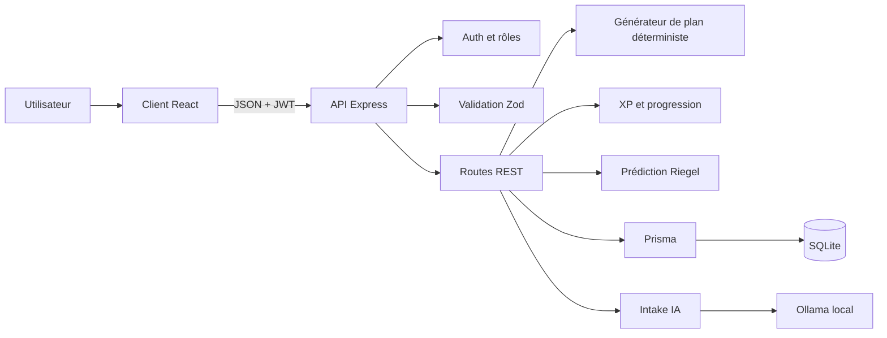
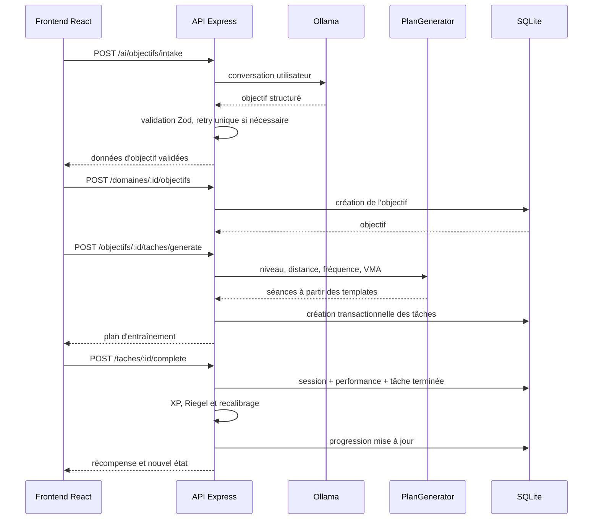

# Coach Course à Pied

Application fullstack de coaching running qui transforme un objectif de course en plan d'entraînement progressif, permet de valider chaque séance et attribue l'XP exclusivement côté serveur.

## Fonctionnalités

- inscription et connexion JWT ;
- rôle `user` ou `admin` embarqué dans le token ;
- domaine unique « Course à pied » créé automatiquement ;
- intake conversationnel assisté par IA ;
- création d'un objectif structuré ;
- génération déterministe d'un plan d'entraînement ;
- suivi des séances et performances ;
- prédiction de performance par la formule de Riegel ;
- recalibrage du plan ;
- XP, niveaux et récompenses calculés côté serveur ;
- routes administrateur protégées.

## Stack

- Frontend : React, Vite, React Router, TanStack Query, Tailwind CSS.
- Backend : Node.js, Express, Prisma, SQLite.
- Authentification : JWT et bcryptjs.
- Validation : Zod.
- IA : Ollama, modèle `llama3.2:3b`, uniquement pour l'intake.
- Tests backend : `node --test`.

## Architecture



## Flux principal



## Place de l'IA

L'IA n'élabore pas directement le plan d'entraînement. Elle intervient seulement pendant l'intake conversationnel afin de transformer les réponses libres en données structurées.

La sortie du LLM est validée avec Zod. En cas de JSON invalide, le backend effectue un seul nouvel essai, puis renvoie une erreur `502`. Le plan est ensuite généré par du code déterministe afin d'obtenir un résultat testable, reproductible et explicable.

## Modèle de données

Le MCD, le MLD, les cardinalités, clés étrangères et règles de suppression sont documentés dans [`docs/mcd-mld.md`](docs/mcd-mld.md).

## API REST

Toutes les routes privées nécessitent `Authorization: Bearer <token>`.

| Méthode | Route | Accès | Résultat principal |
|---|---|---|---|
| POST | `/auth/register` | Public | crée un utilisateur `user` |
| POST | `/auth/login` | Public | renvoie JWT et utilisateur public |
| GET | `/domaines` | User | renvoie le domaine running |
| GET | `/domaines/:id/progression` | User | progression, objectif et séances |
| POST | `/domaines/:id/objectifs` | User | crée un objectif |
| PUT | `/objectifs/:id` | User | modifie titre et description |
| PATCH | `/objectifs/:id/abandon` | User | abandonne l'objectif sans XP |
| PATCH | `/objectifs/:id/validate` | User | valide l'objectif et attribue l'XP |
| POST | `/ai/objectifs/intake` | User | intake conversationnel IA |
| POST | `/objectifs/:id/taches/generate` | User | génère le plan déterministe |
| POST | `/taches/:id/complete` | User | termine une séance et calcule l'XP |
| GET | `/objectifs/:id/sessions` | User | historique des sessions |
| POST | `/sessions/:id/feedback` | User | ajoute un feedback |
| GET | `/admin/users` | Admin | liste utilisateurs et statistiques |

Codes utilisés : `200`, `201`, `400`, `401`, `403`, `404`, `409` et `502`.

## Sécurité

- mots de passe hashés avec bcryptjs ;
- JWT signé contenant `userId` et `role` ;
- inscription incapable de créer un administrateur ;
- middleware d'authentification puis `requireRole("admin")` ;
- validation Zod des entrées et sorties IA ;
- Helmet et rate limiting ;
- vérification d'appartenance des ressources ;
- réponse `404` utilisée pour ne pas révéler les ressources d'un autre utilisateur ;
- aucun montant d'XP accepté depuis le client ;
- aucun secret exposé au frontend.

## Prérequis

- Node.js 20.19+ ou 22.12+ ;
- npm ;
- Ollama pour l'intake IA.

```bash
ollama pull llama3.2:3b
```

## Configuration

`server/.env` :

```env
DATABASE_URL="file:./dev.db"
JWT_SECRET="change-me"
OLLAMA_URL="http://localhost:11434"
OLLAMA_MODEL="llama3.2:3b"
PORT=4000
HOST="127.0.0.1"
```

`client/.env` :

```env
VITE_API_URL="http://127.0.0.1:4000"
```

## Installation et démarrage

Depuis la racine :

```bash
./start.sh
```

Installation manuelle du backend :

```bash
cd server
cp .env.example .env
npm install
npx prisma migrate dev
npm run db:seed
npm run dev
```

Frontend :

```bash
cd client
cp .env.example .env
npm install
npm run dev
```

Application : `http://localhost:5173`.

## Comptes de test

Le seed est idempotent et crée les comptes suivants, tous avec le mot de passe `Test123!` et le rôle `user` :

| Nom | Email | Objectif principal | Niveau de départ |
|---|---|---|---|
| Lucas Martin | `lucas@test.local` | Courir 10 km en moins de 50 minutes | Intermédiaire |
| Emma Dupont | `emma@test.local` | Courir son premier marathon | Débutante sur longue distance |
| Hugo Bernard | `hugo@test.local` | Courir 5 km en moins de 25 minutes | Débutant régulier |

## Vérifications

```bash
cd server
npm test
npx prisma validate

cd ../client
npm run lint
npm run build
```

## Wireframes et démonstration

Les écrans attendus et leur flux de données sont décrits dans [`docs/wireframes.md`](docs/wireframes.md). Les captures réelles doivent être ajoutées dans `docs/img/` après lancement local de l'application.

## Limites et pistes d'amélioration

- Le rôle reste figé dans le JWT pendant sa durée de validité, actuellement sept jours.
- Le plan ne possède pas encore de calendrier avec des dates réelles.
- La formule de Riegel est une estimation simplifiée.
- `CoursePage.jsx` reste volumineux et devrait être découpé.
- SQLite convient à la démonstration, mais PostgreSQL serait préférable en production.
- La prédiction nécessite une distance et un temps réellement enregistrés.
- Les captures du README doivent être produites depuis l'application locale finale.

## Analyse critique

Le pivot vers un mono-domaine réduit la couverture fonctionnelle, mais renforce la cohérence du produit. La génération déterministe limite l'effet spectaculaire de l'IA, tout en améliorant la fiabilité et l'explicabilité. La séparation entre intake probabiliste et plan déterministe constitue le principal compromis architectural du projet.
