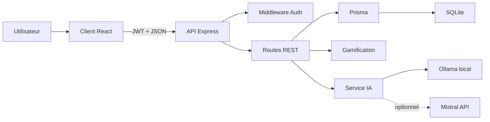
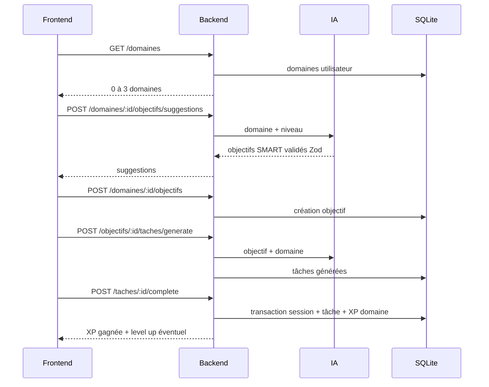

# Système d'évolution

README = source de vérité du projet. Les anciens fichiers de cadrage peuvent rester utiles comme historique, mais l'état fonctionnel attendu est celui décrit ici.

Système d'évolution est une application web de pratique délibérée. Un utilisateur suit jusqu'à **3 domaines** en parallèle, par exemple `Code`, `Course à pied`, `Guitare`, puis l'IA l'aide à transformer une intention vague en objectif SMART et en plan de tâches progressif. Les sessions, l'XP, les niveaux et les récompenses sont calculés côté serveur.

## État Produit Actuel

- Authentification par compte utilisateur avec JWT.
- Tableau de bord multi-domaine, limité à 3 domaines par utilisateur.
- Création, sélection et suppression de domaines.
- Un objectif actif par domaine dans l'interface.
- Suggestions d'objectifs SMART par IA selon le domaine choisi.
- Raffinage IA d'un objectif libre.
- Génération IA d'un plan de tâches ordonnées.
- Complétion atomique d'une tâche : session créée, XP calculée, tâche marquée faite et domaine mis à jour dans une seule transaction backend.
- Validation d'objectif avec gros gain d'XP.
- Historique des objectifs validés.

## Règles Métier

- Le client n'envoie jamais de montant d'XP.
- L'XP de session, les niveaux et les bonus sont calculés dans `server/src/services/gamification.js`.
- La limite de 3 domaines est imposée côté backend sur `POST /domaines`.
- Les appels IA passent uniquement par le backend.
- Les sorties IA sont validées avec Zod avant d'être utilisées.
- Les secrets restent dans `.env`, jamais dans Git.

## Stack

- Frontend : React + Vite + React Router + TanStack Query + Tailwind CSS v4.
- Backend : Node.js + Express + Prisma + SQLite.
- Auth : JWT + bcrypt.
- Validation : Zod.
- IA : Ollama local par défaut, Mistral API possible en option.
- Tests backend : `node --test`.

## Architecture



## Flux Principal



## Routes Principales

Toutes les routes sauf `/auth/*` exigent `Authorization: Bearer <jwt>`.

| Méthode | Route | Rôle |
| --- | --- | --- |
| `POST` | `/auth/register` | Créer un compte |
| `POST` | `/auth/login` | Connexion |
| `GET` | `/domaines` | Liste des domaines du user |
| `POST` | `/domaines` | Créer un domaine, max 3 |
| `GET` | `/domaines/:id/progression` | Domaine + objectifs + objectif actif détaillé |
| `DELETE` | `/domaines/:id` | Supprimer un domaine et ses données |
| `POST` | `/domaines/:id/objectifs/suggestions` | Suggestions IA |
| `POST` | `/ai/objectifs/refine` | Raffiner un objectif libre |
| `POST` | `/domaines/:id/objectifs` | Créer un objectif |
| `POST` | `/objectifs/:id/taches/generate` | Générer le plan IA |
| `POST` | `/taches/:id/complete` | Terminer une tâche avec XP atomique |
| `PATCH` | `/objectifs/:id/validate` | Valider l'objectif |
| `GET` | `/me/stats` | Stats globales |

## Prérequis

- Node.js 20.19+ ou 22.12+.
- Ollama installé pour les fonctions IA locales.
- Modèle Ollama installé :

```bash
ollama pull mistral
```

Pour des réponses IA plus rapides :

```bash
ollama pull llama3.2:3b
```

puis changer `OLLAMA_MODEL` dans `server/.env`.

## Configuration

Backend : `server/.env`

```bash
DATABASE_URL="file:./dev.db"
JWT_SECRET="change-me"
AI_PROVIDER="ollama"
OLLAMA_URL="http://localhost:11434"
OLLAMA_MODEL="mistral"
MISTRAL_API_KEY=""
PORT=4000
HOST="127.0.0.1"
```

Frontend : `client/.env`

```bash
VITE_API_URL="http://127.0.0.1:4000"
```

Le backend valide la configuration au démarrage. En production, `JWT_SECRET` doit être remplacé.

## Démarrage Rapide

Depuis la racine :

```bash
./start.sh
```

Arrêt :

```bash
./stop.sh
```

## Démarrage Manuel

Backend :

```bash
cd server
cp .env.example .env
npm install
npx prisma migrate dev
npm run dev
```

Frontend :

```bash
cd client
cp .env.example .env
npm install
npm run dev
```

Ouvrir ensuite `http://localhost:5173`.

## Vérifications

Backend :

```bash
cd server
npm test
npx prisma validate
```

Frontend :

```bash
cd client
npm run lint
npm run build
```

Utiliser Node 22 localement si Vite refuse Node 20.9.0.

## Structure

```text
systeme/
├── server/
│   ├── prisma/
│   └── src/
│       ├── app.js
│       ├── index.js
│       ├── config/
│       ├── middleware/
│       ├── routes/
│       ├── services/
│       └── validation/
├── client/
│   └── src/
│       ├── api/
│       ├── components/
│       ├── lib/
│       └── pages/
└── README.md
```

## Points À Ne Pas Casser

- Ne jamais calculer l'XP côté client.
- Ne jamais exposer de clé IA côté frontend.
- Ne pas contourner Zod sur les payloads qui écrivent ou les réponses IA.
- Ne pas dépasser 3 domaines par utilisateur.
- Garder `/taches/:id/complete` comme flux principal pour terminer une tâche planifiée.
