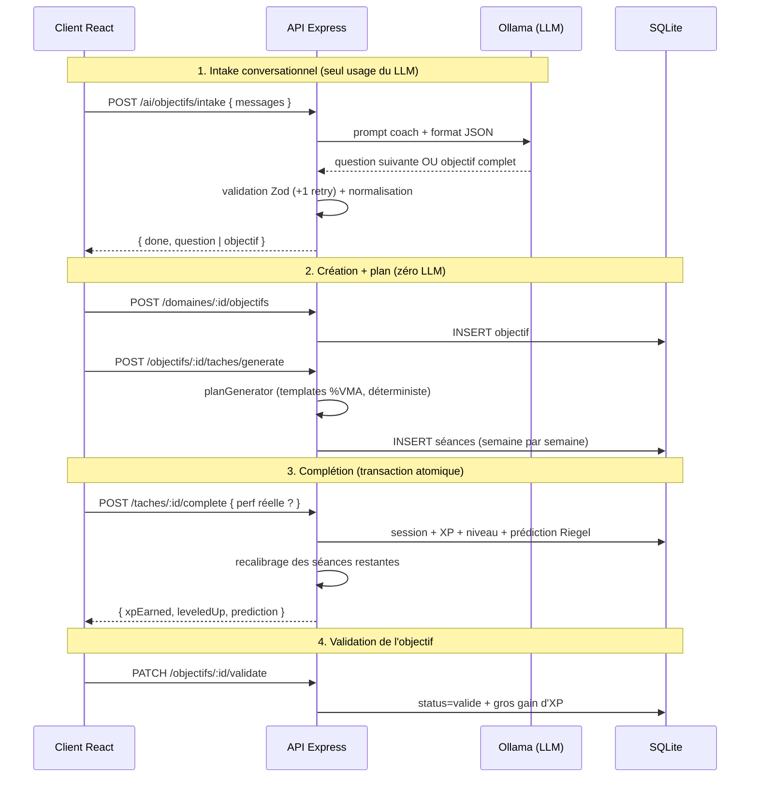
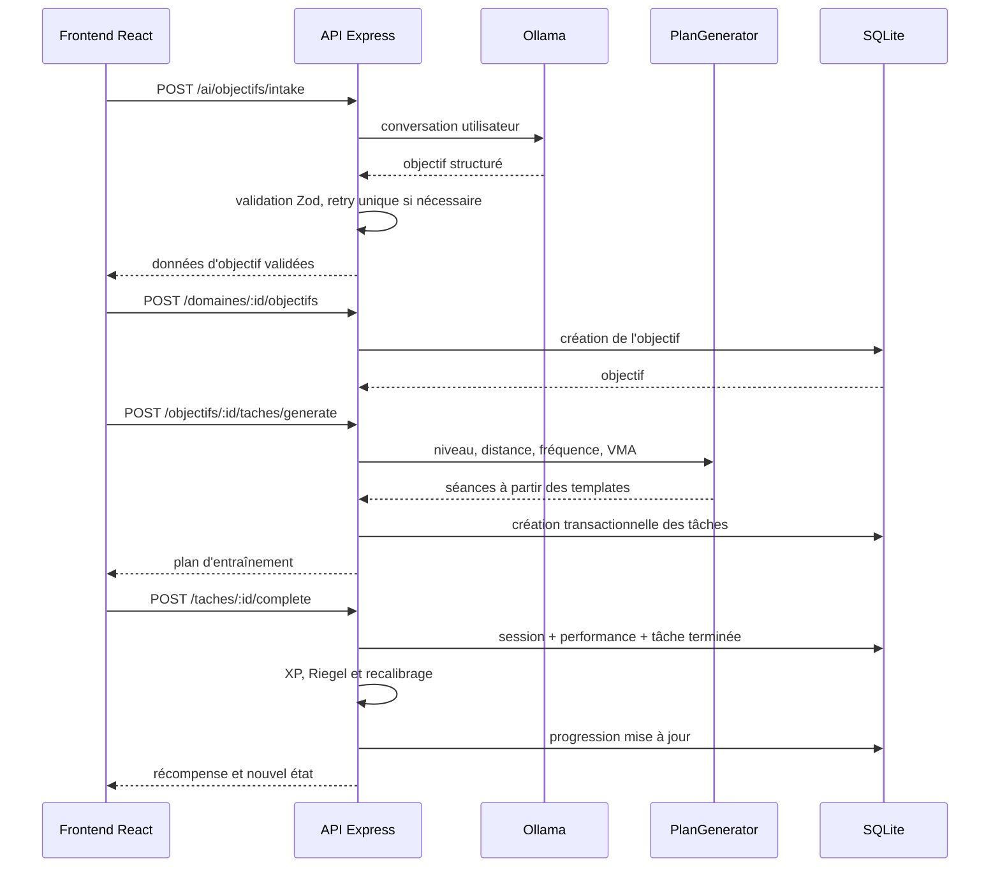

# Coach Course à Pied

Application fullstack de coaching running qui transforme un objectif de course en plan d'entraînement progressif, permet de valider chaque séance et attribue l'XP exclusivement côté serveur.

## Fonctionnalités

- inscription et connexion JWT ;
- rôle `user` ou `admin` embarqué dans le token ;
- domaine unique « Course à pied » créé automatiquement ;
- intake conversationnel assisté par IA ;
- création d'un objectif structuré ;
- génération déterministe d'un plan d'entraînement ;
- suivi des séances et performances ;
- prédiction de performance par la formule de Riegel ;
- recalibrage du plan ;
- XP, niveaux et récompenses calculés côté serveur ;
- routes administrateur protégées.

## Stack

- Frontend : React, Vite, React Router, TanStack Query, Tailwind CSS.
- Backend : Node.js, Express, Prisma, SQLite.
- Authentification : JWT et bcryptjs.
- Validation : Zod.
- IA : Ollama, modèle `llama3.2:3b`, uniquement pour l'intake.
- Tests backend : `node --test`.

## Architecture

```mermaid
flowchart LR
<<<<<<< HEAD
  U["Coureur"] --> C["Client React<br/>(TanStack Query)"]
  C -->|"JWT + JSON"| API["API Express"]
  API --> AUTH["Middleware auth<br/>+ requireRole"]
  API --> ROUTES["Routes REST"]
  ROUTES --> ZOD["Validation Zod"]
  ROUTES --> GAME["gamification.js<br/>(XP serveur)"]
  ROUTES --> PLAN["planGenerator.js<br/>(déterministe)"]
  ROUTES --> PRED["prediction.js<br/>(Riegel)"]
  ROUTES --> PRISMA["Prisma"] --> DB[("SQLite")]
  ROUTES --> AI["ai.js<br/>(intake uniquement)"]
  AI --> OLLAMA["Ollama local"]
  AI -. "optionnel" .-> MISTRAL["Mistral API"]
```

### Flux principal (bout en bout)



## La place de l'IA (choix assumé)

Le LLM ne sert **que** pour l'intake conversationnel — recueillir les paramètres de l'objectif en
langage naturel. Le plan d'entraînement, les allures, la prédiction et le recalibrage sont
**calculés par le serveur, de façon déterministe**. Raison documentée dans
l'[ADR 0001](docs/adr/0001-plan-deterministe-llm-intake-seulement.md) : un petit modèle local se
trompe sur les tâches chiffrées (allures, structures JSON longues), alors qu'un générateur
déterministe est fiable, testable et instantané. Chaque sortie LLM est validée par un schéma Zod
strict avec un retry, sinon erreur 502 propre. La fonctionnalité IA est donc réellement
implémentée et démontrable (pas un mock) — mais cantonnée là où elle apporte de la valeur.

## Modèle de données
=======
    U[Utilisateur] --> UI[Client React]
    UI -->|JSON + JWT| API[API Express]
    API --> AUTH[Auth et rôles]
    API --> ZOD[Validation Zod]
    API --> ROUTES[Routes REST]
    ROUTES --> PLAN[Générateur de plan déterministe]
    ROUTES --> GAME[XP et progression]
    ROUTES --> RIEGEL[Prédiction Riegel]
    ROUTES --> PRISMA[Prisma]
    PRISMA --> DB[(SQLite)]
    ROUTES --> AI[Intake IA]
    AI --> OLLAMA[Ollama local]
```

## Flux principal



## Place de l'IA

L'IA n'élabore pas directement le plan d'entraînement. Elle intervient seulement pendant l'intake conversationnel afin de transformer les réponses libres en données structurées.

La sortie du LLM est validée avec Zod. En cas de JSON invalide, le backend effectue un seul nouvel essai, puis renvoie une erreur `502`. Le plan est ensuite généré par du code déterministe afin d'obtenir un résultat testable, reproductible et explicable.

Voir également `CONTEXT.md` et `docs/adr/`.

## Modèle de données

Le MCD, le MLD, les cardinalités, clés étrangères et règles de suppression sont documentés dans [`docs/mcd-mld.md`](docs/mcd-mld.md).

## API REST

Toutes les routes privées nécessitent `Authorization: Bearer <token>`.

| Méthode | Route | Accès | Résultat principal |
|---|---|---|---|
| POST | `/auth/register` | Public | crée un utilisateur `user` |
| POST | `/auth/login` | Public | renvoie JWT et utilisateur public |
| GET | `/domaines` | User | renvoie le domaine running |
| GET | `/domaines/:id/progression` | User | progression, objectif et séances |
| POST | `/domaines/:id/objectifs` | User | crée un objectif |
| PATCH | `/objectifs/:id` | User | modifie titre et description |
| PATCH | `/objectifs/:id/validate` | User | valide l'objectif et attribue l'XP |
| POST | `/ai/objectifs/intake` | User | intake conversationnel IA |
| POST | `/objectifs/:id/taches/generate` | User | génère le plan déterministe |
| POST | `/taches/:id/complete` | User | termine une séance et calcule l'XP |
| GET | `/sessions` | User | historique des sessions |
| POST | `/sessions/:id/feedback` | User | ajoute un feedback |
| GET | `/admin/users` | Admin | liste utilisateurs et statistiques |

Codes utilisés : `200`, `201`, `400`, `401`, `403`, `404`, `409` et `502`.

## Sécurité

- mots de passe hashés avec bcryptjs ;
- JWT signé contenant `userId` et `role` ;
- inscription incapable de créer un administrateur ;
- middleware d'authentification puis `requireRole("admin")` ;
- validation Zod des entrées et sorties IA ;
- Helmet et rate limiting ;
- vérification d'appartenance des ressources ;
- réponse `404` utilisée pour ne pas révéler les ressources d'un autre utilisateur ;
- aucun montant d'XP accepté depuis le client ;
- aucun secret exposé au frontend.
>>>>>>> origin/docs/phases-4-8-coach-running

6 entités : `User` (1) ─ `Domaine` (« Course à pied », auto-créé, porte l'XP) ─ `Objectif` ─
`Tache` (= séance du plan) ─ `Session` (pratique loggée + perf réelle) ─ `Feedback`.

<<<<<<< HEAD
➡️ **MCD + MLD complets et notes de conception : [`docs/mcd-mld.md`](docs/mcd-mld.md)**

## API REST

Base : `http://127.0.0.1:4000`. Toutes les routes (sauf `public`) exigent
`Authorization: Bearer <jwt>`. Collection [Bruno](https://www.usebruno.com/) prête à l'emploi
dans [`bruno/`](bruno/).

| Méthode | Route | Accès | Description |
| --- | --- | --- | --- |
| GET | `/health` | public | Healthcheck |
| POST | `/auth/register` | public | Inscription (auto-crée le domaine) → `201 { user, token }` |
| POST | `/auth/login` | public | Connexion → `{ user, token }` |
| GET | `/me/stats` | user | Stats agrégées (niveau, heures, % maîtrise) |
| POST | `/ai/objectifs/intake` | user | **IA** : conversation coach → objectif SMART |
| GET | `/domaines` | user | Le domaine unique du coureur |
| GET | `/domaines/:id/progression` | user | Domaine + objectifs + objectif actif détaillé |
| POST | `/domaines/:id/objectifs` | user | Créer un objectif de course → `201` |
| GET | `/objectifs/:id` | user | Détail (+ séances + sessions) |
| PUT | `/objectifs/:id` | user | Modifier titre/description uniquement |
| DELETE | `/objectifs/:id` | user | Supprimer / abandonner |
| PATCH | `/objectifs/:id/validate` | user | Valider → gros gain d'XP (une seule fois) |
| POST | `/objectifs/:id/taches/generate` | user | Générer le plan (déterministe, zéro LLM) → `201` |
| GET | `/objectifs/:id/taches` | user | Les séances du plan |
| POST | `/taches/:id/complete` | user | Compléter une séance (+ perf réelle) → `201` XP + prédiction |
| POST | `/objectifs/:id/sessions` | user | Logger une session libre → `201` XP |
| GET | `/objectifs/:id/sessions` | user | Historique des sessions |
| POST | `/sessions/:id/feedback` | user | Feedback (+ bonus XP ×1.5 différentiel) → `201` |
| GET | `/admin/users` | **admin** | Liste des coureurs + stats de progression |
| GET | `/admin/stats` | **admin** | Agrégats globaux de la plateforme |

**Codes d'erreur** : `400` validation Zod, `401` non authentifié, `403` rôle insuffisant,
`404` ressource introuvable **ou n'appartenant pas à l'utilisateur**, `409` conflit d'unicité,
`502` sortie IA invalide après retry. Toutes les erreurs sont en JSON `{ "error": "message" }`.

## Sécurité

- **JWT** signé (`expiresIn: 7d`), rôle embarqué dans le payload ; `requireRole("admin")` renvoie
  `403` (distinction authentification / autorisation).
- **Un compte admin ne peut pas être créé via l'API** : `/auth/register` force `role=user` ;
  l'admin est seedé côté serveur (`npm run db:seed`).
- **Mots de passe hashés** avec bcryptjs (10 rounds), jamais renvoyés par l'API.
- **Cloisonnement par propriétaire** : toute ressource est filtrée par `userId` — accéder à la
  ressource d'un autre renvoie `404` (pas de fuite d'existence).
- **Anti-triche XP** : le client n'envoie jamais d'XP ni de difficulté — la difficulté d'une séance
  est dérivée de son template côté serveur, l'XP est calculée et appliquée en transaction.
  Les updates génériques qui permettaient de contourner ce calcul ont été supprimés.
- **Divers** : `helmet`, CORS restreint, rate-limit sur `/auth` (20 req / 15 min), validation Zod
  sur chaque endpoint d'écriture, secrets dans `.env` (gitignore) avec `.env.example` fournis.

## Installation & démarrage

Prérequis : **Node.js 20.19+ ou 22.12+**, **Ollama** (pour l'IA locale).
=======
- Node.js 20.19+ ou 22.12+ ;
- npm ;
- Ollama pour l'intake IA.
>>>>>>> origin/docs/phases-4-8-coach-running

```bash
# 1. Modèle IA local (une fois)
ollama pull llama3.2:3b

<<<<<<< HEAD
# 2. Tout lancer (installe les deps, crée les .env et la base au premier run)
=======
## Configuration

`server/.env` :

```env
DATABASE_URL="file:./dev.db"
JWT_SECRET="change-me"
AI_PROVIDER="ollama"
OLLAMA_URL="http://localhost:11434"
OLLAMA_MODEL="llama3.2:3b"
ADMIN_EMAIL="admin@example.com"
ADMIN_PASSWORD="change-me-now"
PORT=4000
HOST="127.0.0.1"
```

`client/.env` :

```env
VITE_API_URL="http://127.0.0.1:4000"
```

## Installation et démarrage

Depuis la racine :

```bash
>>>>>>> origin/docs/phases-4-8-coach-running
./start.sh
# → http://127.0.0.1:5173   (arrêt : ./stop.sh)

# 3. Créer le compte admin (optionnel, pour /admin/*)
cd server && npm run db:seed
# → admin@coach.local / admin123! (surchargable via ADMIN_EMAIL / ADMIN_PASSWORD)
```

<<<<<<< HEAD
<details>
<summary>Démarrage manuel (sans start.sh)</summary>
=======
Installation manuelle du backend :
>>>>>>> origin/docs/phases-4-8-coach-running

```bash
# Backend
cd server
cp .env.example .env
npm install
<<<<<<< HEAD
npx prisma migrate deploy
npm run dev            # port 4000
=======
npx prisma migrate dev
npm run db:seed
npm run dev
```
>>>>>>> origin/docs/phases-4-8-coach-running

# Frontend (autre terminal)
cd client
cp .env.example .env
npm install
npm run dev            # port 5173

# IA locale (autre terminal)
ollama serve
```
</details>

<<<<<<< HEAD
## Configuration (`server/.env`)
=======
Application : `http://localhost:5173`.
>>>>>>> origin/docs/phases-4-8-coach-running

| Variable | Défaut | Rôle |
| --- | --- | --- |
| `DATABASE_URL` | `file:./dev.db` | Base SQLite |
| `JWT_SECRET` | `change-me` | Signature des tokens (à changer) |
| `AI_PROVIDER` | `ollama` | `ollama` \| `mistral` |
| `OLLAMA_URL` | `http://localhost:11434` | Serveur Ollama |
| `OLLAMA_MODEL` | `llama3.2:3b` | Modèle local (rapide) |
| `MISTRAL_API_KEY` | — | Requis si `AI_PROVIDER=mistral` |
| `CORS_ORIGIN` | `http://localhost:5173,…` | Origines autorisées |
| `ADMIN_EMAIL` / `ADMIN_PASSWORD` | `admin@coach.local` / `admin123!` | Compte seedé par `db:seed` |

<<<<<<< HEAD
Côté client : `VITE_API_URL` (défaut `http://127.0.0.1:4000`).

## Tests

```bash
cd server && npm test        # 20 tests (node --test + supertest, base test.db dédiée)
```

Couverture : auth (401/403/200 par rôle), isolation entre utilisateurs, validation des payloads,
anti-triche XP (difficulté dérivée du template), idempotence complétion/validation,
prédiction/recalibrage Riegel, gamification (montées de niveau multiples).

## Limites connues & pistes d'amélioration

- **Rôle figé dans le JWT 7 jours** : pas de refresh token — un changement de rôle n'est effectif
  qu'à la reconnexion. Piste : refresh tokens courts + révocation.
- **Schéma hérité du multi-domaines** : `domaine.description`, `domaine.status` et les métriques
  génériques d'`objectif` sont des vestiges conservés pour éviter une migration destructive
  (documentés dans le [MLD](docs/mcd-mld.md)).
- **Plan sans dates réelles** : les séances sont groupées par index de semaine, pas de
  calendrier ni de replanification en cas de séance manquée.
- **Prédiction simpliste** : Riegel (exposant 1.06) ignore le dénivelé, la météo et la fatigue.
- **`CoursePage.jsx` fait ~650 lignes** : à découper en sous-composants (hors périmètre du rendu).
- **SQLite mono-poste** : suffisant pour la démo locale ; passage à PostgreSQL requis pour du
  multi-utilisateurs en production.
- **IA volontairement cantonnée à l'intake** ([ADR 0001](docs/adr/0001-plan-deterministe-llm-intake-seulement.md)) :
  un modèle plus capable permettrait d'enrichir les conseils de séance ou d'expliquer le
  recalibrage en langage naturel.
- **`planGenerator.js` sans tests unitaires dédiés** : couvert indirectement par les tests d'API.
=======
```bash
cd server
npm test
npx prisma validate

cd ../client
npm run lint
npm run build
```

## Wireframes et démonstration

Les écrans attendus et leur flux de données sont décrits dans [`docs/wireframes.md`](docs/wireframes.md). Les captures réelles doivent être ajoutées dans `docs/img/` après lancement local de l'application.

## Limites et pistes d'amélioration

- Le rôle reste figé dans le JWT pendant sa durée de validité, actuellement sept jours.
- Le schéma conserve des colonnes issues de l'ancien système multi-domaines.
- Le plan ne possède pas encore de calendrier avec des dates réelles.
- La formule de Riegel est une estimation simplifiée.
- `CoursePage.jsx` reste volumineux et devrait être découpé.
- SQLite convient à la démonstration, mais PostgreSQL serait préférable en production.
- Le générateur de plan devrait disposer d'une suite de tests dédiée.
- Les captures du README doivent être produites depuis l'application locale finale.

## Analyse critique

Le pivot vers un mono-domaine réduit la couverture fonctionnelle, mais renforce la cohérence du produit. La génération déterministe limite l'effet spectaculaire de l'IA, tout en améliorant la fiabilité et l'explicabilité. La séparation entre intake probabiliste et plan déterministe constitue le principal compromis architectural du projet.
>>>>>>> origin/docs/phases-4-8-coach-running
