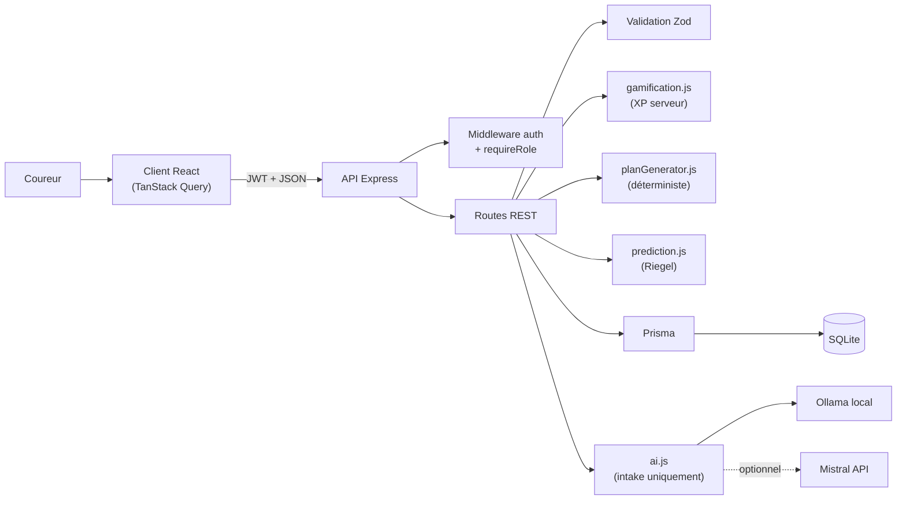
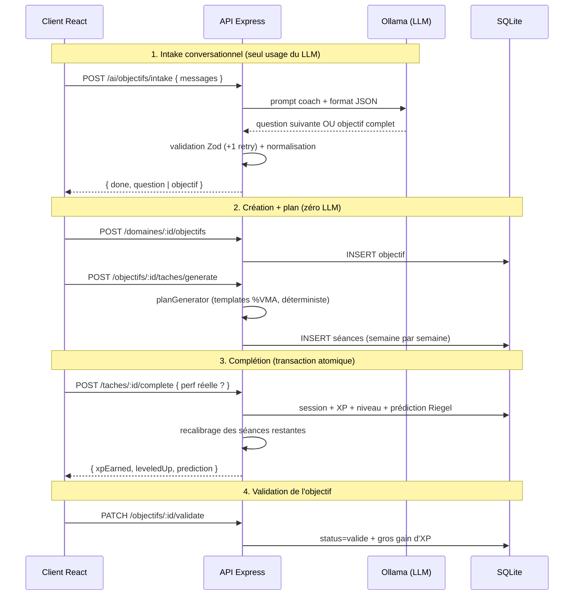

# Coach Course à Pied 🏃

> **README = source de vérité du projet.** Vocabulaire métier : [`CONTEXT.md`](CONTEXT.md) ·
> Décision d'architecture IA : [`docs/adr/0001-plan-deterministe-llm-intake-seulement.md`](docs/adr/0001-plan-deterministe-llm-intake-seulement.md)

Application web fullstack de coaching course à pied. Le coureur décrit son objectif en langage
naturel (« courir un 10 km en 50 minutes d'ici fin août ») ; une **IA conversationnelle** recueille
les paramètres manquants, puis le serveur **génère un plan d'entraînement déterministe** (séances
en % de VMA), **prédit** la performance via la formule de Riegel et **recalibre** les séances
restantes à chaque performance réelle loggée. Le tout est **gamifié** : XP, niveaux et récompenses,
calculés exclusivement côté serveur.

📸 Écrans clés et wireframes : [`docs/wireframes.md`](docs/wireframes.md)

## Fonctionnalités

- **Authentification JWT** (register/login, bcrypt) avec **gestion des rôles** `user` / `admin`.
- **Intake conversationnel IA** : le coach pose au plus 4 questions pour transformer une intention
  vague en objectif SMART (archétype `chrono` ou `completion`, distance, échéance, fréquence).
- **Plan d'entraînement déterministe** : 5 à 20 semaines de séances issues d'un catalogue fermé de
  8 templates (endurance fondamentale, VO2, seuil, allure spécifique, sortie longue…), allures
  exprimées en % de VMA.
- **Complétion atomique d'une séance** : session créée, XP calculée, prédiction mise à jour et
  séances restantes recalibrées — dans une seule transaction.
- **Prédiction Riegel** : estimation du chrono (ou de la plus longue distance) recalculée à chaque
  perf réelle, jamais par le LLM.
- **Gamification serveur** : XP par séance (durée × difficulté), montées de niveau
  (seuil = 100 × niveau^1.6), gros gain à la validation de l'objectif, barre des 10 000 heures.
- **Espace admin** : liste des coureurs et stats globales, réservées au rôle `admin`.

## Stack

| Couche | Techno |
| --- | --- |
| Frontend | React 19 + Vite, React Router, TanStack Query, Tailwind CSS v4 |
| Backend | Node.js + Express, Prisma ORM |
| Base de données | SQLite (fichier local, zéro infra) |
| Auth | JWT (rôle embarqué dans le payload) + bcryptjs |
| Validation | Zod (entrées API **et** sorties LLM) |
| IA | Ollama local (`llama3.2:3b`) ; Mistral API en option |
| Tests | `node --test` + supertest (20 tests) |

## Architecture



### Flux principal (bout en bout)



## La place de l'IA (choix assumé)

Le LLM ne sert **que** pour l'intake conversationnel — recueillir les paramètres de l'objectif en
langage naturel. Le plan d'entraînement, les allures, la prédiction et le recalibrage sont
**calculés par le serveur, de façon déterministe**. Raison documentée dans
l'[ADR 0001](docs/adr/0001-plan-deterministe-llm-intake-seulement.md) : un petit modèle local se
trompe sur les tâches chiffrées (allures, structures JSON longues), alors qu'un générateur
déterministe est fiable, testable et instantané. Chaque sortie LLM est validée par un schéma Zod
strict avec un retry, sinon erreur 502 propre. La fonctionnalité IA est donc réellement
implémentée et démontrable (pas un mock) — mais cantonnée là où elle apporte de la valeur.

## Modèle de données

6 entités : `User` (1) ─ `Domaine` (« Course à pied », auto-créé, porte l'XP) ─ `Objectif` ─
`Tache` (= séance du plan) ─ `Session` (pratique loggée + perf réelle) ─ `Feedback`.

➡️ **MCD + MLD complets et notes de conception : [`docs/mcd-mld.md`](docs/mcd-mld.md)**

## API REST

Base : `http://127.0.0.1:4000`. Toutes les routes (sauf `public`) exigent
`Authorization: Bearer <jwt>`. Collection [Bruno](https://www.usebruno.com/) prête à l'emploi
dans [`bruno/`](bruno/).

| Méthode | Route | Accès | Description |
| --- | --- | --- | --- |
| GET | `/health` | public | Healthcheck |
| POST | `/auth/register` | public | Inscription (auto-crée le domaine) → `201 { user, token }` |
| POST | `/auth/login` | public | Connexion → `{ user, token }` |
| GET | `/me/stats` | user | Stats agrégées (niveau, heures, % maîtrise) |
| POST | `/ai/objectifs/intake` | user | **IA** : conversation coach → objectif SMART |
| GET | `/domaines` | user | Le domaine unique du coureur |
| GET | `/domaines/:id/progression` | user | Domaine + objectifs + objectif actif détaillé |
| POST | `/domaines/:id/objectifs` | user | Créer un objectif de course → `201` |
| GET | `/objectifs/:id` | user | Détail (+ séances + sessions) |
| PUT | `/objectifs/:id` | user | Modifier titre/description uniquement |
| DELETE | `/objectifs/:id` | user | Supprimer / abandonner |
| PATCH | `/objectifs/:id/validate` | user | Valider → gros gain d'XP (une seule fois) |
| POST | `/objectifs/:id/taches/generate` | user | Générer le plan (déterministe, zéro LLM) → `201` |
| GET | `/objectifs/:id/taches` | user | Les séances du plan |
| POST | `/taches/:id/complete` | user | Compléter une séance (+ perf réelle) → `201` XP + prédiction |
| POST | `/objectifs/:id/sessions` | user | Logger une session libre → `201` XP |
| GET | `/objectifs/:id/sessions` | user | Historique des sessions |
| POST | `/sessions/:id/feedback` | user | Feedback (+ bonus XP ×1.5 différentiel) → `201` |
| GET | `/admin/users` | **admin** | Liste des coureurs + stats de progression |
| GET | `/admin/stats` | **admin** | Agrégats globaux de la plateforme |

**Codes d'erreur** : `400` validation Zod, `401` non authentifié, `403` rôle insuffisant,
`404` ressource introuvable **ou n'appartenant pas à l'utilisateur**, `409` conflit d'unicité,
`502` sortie IA invalide après retry. Toutes les erreurs sont en JSON `{ "error": "message" }`.

## Sécurité

- **JWT** signé (`expiresIn: 7d`), rôle embarqué dans le payload ; `requireRole("admin")` renvoie
  `403` (distinction authentification / autorisation).
- **Un compte admin ne peut pas être créé via l'API** : `/auth/register` force `role=user` ;
  l'admin est seedé côté serveur (`npm run db:seed`).
- **Mots de passe hashés** avec bcryptjs (10 rounds), jamais renvoyés par l'API.
- **Cloisonnement par propriétaire** : toute ressource est filtrée par `userId` — accéder à la
  ressource d'un autre renvoie `404` (pas de fuite d'existence).
- **Anti-triche XP** : le client n'envoie jamais d'XP ni de difficulté — la difficulté d'une séance
  est dérivée de son template côté serveur, l'XP est calculée et appliquée en transaction.
  Les updates génériques qui permettaient de contourner ce calcul ont été supprimés.
- **Divers** : `helmet`, CORS restreint, rate-limit sur `/auth` (20 req / 15 min), validation Zod
  sur chaque endpoint d'écriture, secrets dans `.env` (gitignore) avec `.env.example` fournis.

## Installation & démarrage

Prérequis : **Node.js 20.19+ ou 22.12+**, **Ollama** (pour l'IA locale).

```bash
# 1. Modèle IA local (une fois)
ollama pull llama3.2:3b

# 2. Tout lancer (installe les deps, crée les .env et la base au premier run)
./start.sh
# → http://127.0.0.1:5173   (arrêt : ./stop.sh)

# 3. Créer le compte admin (optionnel, pour /admin/*)
cd server && npm run db:seed
# → admin@coach.local / admin123! (surchargable via ADMIN_EMAIL / ADMIN_PASSWORD)
```

<details>
<summary>Démarrage manuel (sans start.sh)</summary>

```bash
# Backend
cd server
cp .env.example .env
npm install
npx prisma migrate deploy
npm run dev            # port 4000

# Frontend (autre terminal)
cd client
cp .env.example .env
npm install
npm run dev            # port 5173

# IA locale (autre terminal)
ollama serve
```
</details>

## Configuration (`server/.env`)

| Variable | Défaut | Rôle |
| --- | --- | --- |
| `DATABASE_URL` | `file:./dev.db` | Base SQLite |
| `JWT_SECRET` | `change-me` | Signature des tokens (à changer) |
| `AI_PROVIDER` | `ollama` | `ollama` \| `mistral` |
| `OLLAMA_URL` | `http://localhost:11434` | Serveur Ollama |
| `OLLAMA_MODEL` | `llama3.2:3b` | Modèle local (rapide) |
| `MISTRAL_API_KEY` | — | Requis si `AI_PROVIDER=mistral` |
| `CORS_ORIGIN` | `http://localhost:5173,…` | Origines autorisées |
| `ADMIN_EMAIL` / `ADMIN_PASSWORD` | `admin@coach.local` / `admin123!` | Compte seedé par `db:seed` |

Côté client : `VITE_API_URL` (défaut `http://127.0.0.1:4000`).

## Tests

```bash
cd server && npm test        # 20 tests (node --test + supertest, base test.db dédiée)
```

Couverture : auth (401/403/200 par rôle), isolation entre utilisateurs, validation des payloads,
anti-triche XP (difficulté dérivée du template), idempotence complétion/validation,
prédiction/recalibrage Riegel, gamification (montées de niveau multiples).

## Limites connues & pistes d'amélioration

- **Rôle figé dans le JWT 7 jours** : pas de refresh token — un changement de rôle n'est effectif
  qu'à la reconnexion. Piste : refresh tokens courts + révocation.
- **Schéma hérité du multi-domaines** : `domaine.description`, `domaine.status` et les métriques
  génériques d'`objectif` sont des vestiges conservés pour éviter une migration destructive
  (documentés dans le [MLD](docs/mcd-mld.md)).
- **Plan sans dates réelles** : les séances sont groupées par index de semaine, pas de
  calendrier ni de replanification en cas de séance manquée.
- **Prédiction simpliste** : Riegel (exposant 1.06) ignore le dénivelé, la météo et la fatigue.
- **`CoursePage.jsx` fait ~650 lignes** : à découper en sous-composants (hors périmètre du rendu).
- **SQLite mono-poste** : suffisant pour la démo locale ; passage à PostgreSQL requis pour du
  multi-utilisateurs en production.
- **IA volontairement cantonnée à l'intake** ([ADR 0001](docs/adr/0001-plan-deterministe-llm-intake-seulement.md)) :
  un modèle plus capable permettrait d'enrichir les conseils de séance ou d'expliquer le
  recalibrage en langage naturel.
- **`planGenerator.js` sans tests unitaires dédiés** : couvert indirectement par les tests d'API.
