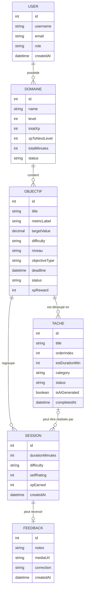

# Modèle de données — Coach Course à Pied

Ce document présente le **MCD** (vision métier) puis le **MLD** (traduction relationnelle) de l'application de coaching de course à pied.

Le modèle est aligné sur `server/prisma/schema.prisma`, en incluant le champ `role` ajouté à l'entité utilisateur lors de la mise en place du contrôle d'accès `user` / `admin`.

## 1. Modèle conceptuel de données (MCD)

### Règles métier associées

- Un utilisateur possède actuellement **un seul domaine fonctionnel**, créé automatiquement avec le nom « Course à pied ».
- La relation reste techniquement modélisée en `1,n` dans Prisma afin de conserver la compatibilité avec le schéma historique multi-domaines.
- Un domaine contient zéro ou plusieurs objectifs.
- Un objectif contient zéro ou plusieurs tâches, qui représentent les séances du plan d'entraînement.
- Une session appartient obligatoirement à un objectif.
- Une session peut être liée à une tâche précise, mais ce lien est facultatif afin de conserver les sessions libres ou l'historique d'une tâche supprimée.
- Une session peut recevoir au maximum un feedback.
- Le rôle d'un utilisateur est soit `user`, soit `admin`. La création publique d'un compte attribue toujours le rôle `user`.

## 2. Modèle logique de données (MLD)

```mermaid
erDiagram
    user ||--o{ domaine : "user_id"
    domaine ||--o{ objectif : "domaine_id"
    objectif ||--o{ tache : "objectif_id"
    objectif ||--o{ session : "objectif_id"
    tache o|--o{ session : "tache_id"
    session ||--o| feedback : "session_id"

    user {
        INTEGER id_user PK
        TEXT username UK
        TEXT email UK
        TEXT password_hash
        TEXT role
        DATETIME created_at
    }

    domaine {
        INTEGER id_domaine PK
        TEXT name
        TEXT description "NULL"
        INTEGER level
        INTEGER total_xp
        INTEGER xp_to_next_level
        INTEGER total_minutes
        TEXT status
        DATETIME created_at
        INTEGER user_id FK
    }

    objectif {
        INTEGER id_objectif PK
        TEXT title
        TEXT description "NULL"
        TEXT raw_input "NULL"
        TEXT metric_label
        TEXT unit "NULL"
        DECIMAL start_value "NULL"
        DECIMAL target_value
        DECIMAL current_value "NULL"
        TEXT difficulty
        TEXT niveau "NULL"
        TEXT objective_type "NULL"
        DATETIME deadline "NULL"
        TEXT status
        INTEGER xp_reward
        BOOLEAN ai_refined
        DATETIME created_at
        DATETIME validated_at "NULL"
        INTEGER domaine_id FK
    }

    tache {
        INTEGER id_tache PK
        TEXT title
        TEXT description "NULL"
        INTEGER order_index
        INTEGER est_duration_min "NULL"
        TEXT category "NULL"
        TEXT status
        BOOLEAN is_ai_generated
        DATETIME completed_at "NULL"
        DATETIME created_at
        INTEGER objectif_id FK
    }

    session {
        INTEGER id_session PK
        TEXT focus_point "NULL"
        INTEGER duration_minutes
        TEXT difficulty
        INTEGER self_rating "NULL"
        INTEGER xp_earned
        DATETIME created_at
        INTEGER objectif_id FK
        INTEGER tache_id FK "NULL"
    }

    feedback {
        INTEGER id_feedback PK
        TEXT notes "NULL"
        TEXT media_url "NULL"
        TEXT correction "NULL"
        DATETIME created_at
        INTEGER session_id FK,UK
    }
```

## 3. Correspondance Prisma ↔ base relationnelle

Prisma utilise des noms de propriétés en `camelCase` dans le code JavaScript et des noms de tables et colonnes en `snake_case` dans SQLite.

| Modèle Prisma | Table SQLite | Clé primaire |
|---|---|---|
| `User` | `user` | `id_user` |
| `Domaine` | `domaine` | `id_domaine` |
| `Objectif` | `objectif` | `id_objectif` |
| `Tache` | `tache` | `id_tache` |
| `Session` | `session` | `id_session` |
| `Feedback` | `feedback` | `id_feedback` |

Cette correspondance est déclarée avec `@map(...)`, `@@map(...)` et `@relation(...)`.

## 4. Clés étrangères et suppressions

| Clé étrangère | Référence | Suppression |
|---|---|---|
| `domaine.user_id` | `user.id_user` | `ON DELETE CASCADE` |
| `objectif.domaine_id` | `domaine.id_domaine` | `ON DELETE CASCADE` |
| `tache.objectif_id` | `objectif.id_objectif` | `ON DELETE CASCADE` |
| `session.objectif_id` | `objectif.id_objectif` | `ON DELETE CASCADE` |
| `session.tache_id` | `tache.id_tache` | `ON DELETE SET NULL` |
| `feedback.session_id` | `session.id_session` | `ON DELETE CASCADE` |

Le `SET NULL` sur `session.tache_id` conserve l'historique d'entraînement si une tâche est supprimée ou si le plan est recalibré. La contrainte `UNIQUE` sur `feedback.session_id` garantit un feedback maximum par session.

## 5. Normalisation et contraintes

Le modèle suit globalement la **troisième forme normale (3FN)**. Les champs de progression du domaine constituent une dénormalisation volontaire afin d'éviter de recalculer tout l'historique à chaque affichage. Leur mise à jour doit rester transactionnelle et exclusivement réalisée côté serveur.

SQLite ne fournit pas d'`ENUM` natif. Les valeurs autorisées sont donc contrôlées par les schémas Zod de l'API : rôles, statuts, difficulté, niveau du coureur, type d'objectif et catégorie de séance.

## 6. Limites assumées du modèle

Le schéma contient encore `domaine.description` et `domaine.status`, hérités de l'ancienne version multi-domaines. Ces colonnes sont conservées pour éviter une migration destructive le jour du rendu.

Le modèle Prisma autorise plusieurs domaines par utilisateur, alors que l'application actuelle n'en crée et n'en exploite qu'un seul. Une évolution ultérieure pourrait imposer cette règle directement en base avec une contrainte d'unicité sur `domaine.user_id`.
