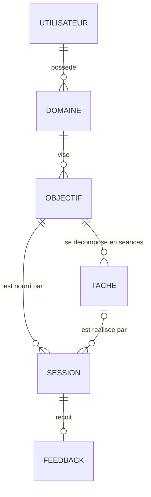

# Modèle de données — MCD & MLD

> Livrable Activité 2. Source de vérité applicative : [`server/prisma/schema.prisma`](../server/prisma/schema.prisma).
> Les diagrammes ci-dessous sont rendus nativement par GitHub (Mermaid).

## 1. MCD — Modèle conceptuel

Six entités. Le vocabulaire métier est défini dans [`CONTEXT.md`](../CONTEXT.md) :
un **Domaine** (« Course à pied », unique par utilisateur, auto-créé à l'inscription) porte la
gamification ; un **Objectif** est la cible du coureur ; une **Tâche** représente une **séance**
du plan d'entraînement ; une **Session** est une pratique loggée (avec perf réelle éventuelle).

Cardinalités et règles métier :

| Association | Cardinalité | Règle |
| --- | --- | --- |
| Utilisateur → Domaine | 1,1 → 0,n en base ; **exactement 1 en pratique** | Le domaine « Course à pied » est auto-créé au register ; aucun CRUD de domaine n'est exposé (contrainte applicative, pas SQL — vestige assumé du schéma multi-domaines d'origine) |
| Domaine → Objectif | 1,1 → 0,n | Un seul objectif `en_cours` à la fois (contrainte applicative) |
| Objectif → Tâche | 1,1 → 0,n | Les séances sont générées par `planGenerator.js` (déterministe) |
| Objectif → Session | 1,1 → 0,n | Toute session est rattachée à l'objectif |
| Tâche → Session | 0,1 → 0,n | Une session peut être libre (sans séance) ; une séance complétée crée sa session |
| Session → Feedback | 1,1 → 0,1 | Au plus un feedback par session (`UNIQUE`) |

## 2. MLD — Modèle logique (SQLite, tables `snake_case`)

```mermaid
erDiagram
    user {
        int id_user PK
        string username UK
        string email UK
        string password_hash
        string role "user | admin (defaut user, seede cote serveur)"
        datetime created_at
    }
    domaine {
        int id_domaine PK
        string name
        string description "nullable - vestige multi-domaines"
        int level "defaut 1"
        int total_xp "XP dans le niveau courant"
        int xp_to_next_level "defaut 100"
        int total_minutes "cumul pratique"
        string status "actif | en_pause | maitrise (vestige)"
        datetime created_at
        int user_id FK "ON DELETE CASCADE"
    }
    objectif {
        int id_objectif PK
        string title
        string description "nullable"
        string raw_input "nullable - saisie brute de l'intake"
        string metric_label
        string unit "nullable"
        decimal start_value "nullable"
        decimal target_value
        decimal current_value "nullable - MAJ par la prediction serveur"
        string difficulty "facile | moyen | difficile"
        string niveau "nullable - debutant | intermediaire | avance"
        string archetype "chrono | completion"
        int frequency "seances/semaine (2..5)"
        float target_distance_km "nullable - distance de reference"
        datetime estimate_updated_at "nullable"
        datetime deadline "nullable"
        string status "en_cours | valide | abandonne"
        int xp_reward "defaut 1000"
        boolean ai_refined
        datetime created_at
        datetime validated_at "nullable"
        int domaine_id FK "ON DELETE CASCADE"
    }
    tache {
        int id_tache PK
        string title
        string description "nullable"
        int order_index
        int week_index "semaine du plan"
        int est_duration_min "nullable"
        string template_key "nullable - cle du template de seance"
        string spec "nullable - JSON, source de verite du recalibrage"
        string target_label "nullable - cible lisible (ex 5 km a 5:00/km)"
        string status "a_faire | en_cours | fait"
        boolean is_ai_generated
        datetime completed_at "nullable"
        datetime created_at
        int objectif_id FK "ON DELETE CASCADE"
    }
    session {
        int id_session PK
        string focus_point "nullable"
        int duration_minutes
        string difficulty "derivee du template cote serveur"
        int self_rating "nullable - 1..5"
        float perf_distance_km "nullable - perf reelle"
        int perf_duration_sec "nullable - perf reelle"
        int xp_earned "calcule serveur, jamais fourni par le client"
        datetime created_at
        int objectif_id FK "ON DELETE CASCADE"
        int tache_id FK "nullable - ON DELETE SET NULL"
    }
    feedback {
        int id_feedback PK
        string notes "nullable"
        string media_url "nullable"
        string correction "nullable"
        datetime created_at
        int session_id FK "UNIQUE - ON DELETE CASCADE"
    }

    user ||--o{ domaine : "user_id"
    domaine ||--o{ objectif : "domaine_id"
    objectif ||--o{ tache : "objectif_id"
    objectif ||--o{ session : "objectif_id"
    tache |o--o{ session : "tache_id (SET NULL)"
    session ||--o| feedback : "session_id (UNIQUE)"
```

## 3. Notes de conception

- **Normalisation (3FN)** : chaque table a une clé primaire technique auto-incrémentée ; aucun
  attribut multivalué ni dépendance transitive — les agrégats (XP, minutes, niveau) sont portés
  par `domaine` qui est justement l'entité de gamification, et recalculés uniquement côté serveur.
- **« Enums » applicatifs** : SQLite ne supporte pas `ENUM`. Les valeurs fermées
  (`role`, `difficulty`, `archetype`, `status`…) sont contraintes par les schémas **Zod**
  ([`server/src/validation/schemas.js`](../server/src/validation/schemas.js)) qui rejettent
  toute valeur hors liste avant persistance.
- **Fidélité MLD ↔ ORM** : les modèles Prisma sont en `PascalCase`/`camelCase` mais mappés en
  `snake_case` via `@map`/`@@map` — le MLD ci-dessus correspond **exactement** aux tables SQL
  générées par les migrations (`server/prisma/migrations/`).
- **`session.tache_id` nullable + `ON DELETE SET NULL`** : une session de pratique survit à la
  suppression de sa séance — l'historique d'XP et de perfs reste intact, seule la référence
  disparaît. Les autres FK sont en `CASCADE` : supprimer un compte efface tout son arbre.
- **`feedback.session_id UNIQUE`** : matérialise la cardinalité 0,1 (au plus un feedback par
  session) directement en SQL.
- **Vestiges assumés** : `domaine.description`, `domaine.status` et les métriques génériques
  d'`objectif` (`metric_label`, `unit`, `start_value`) datent du schéma multi-domaines initial.
  Ils sont conservés pour éviter une migration destructive et documentés dans les
  [limites du projet](../README.md#limites-connues--pistes-damélioration).
