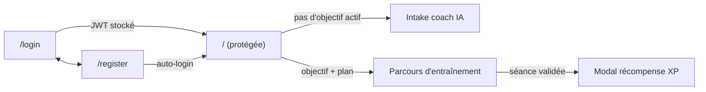

# Wireframes & écrans clés

> Livrable Activité 4/6. Wireframes basse fidélité, navigation, puis rendu final (captures réelles)
> avec le flux de données de chaque écran.

## Navigation



Une seule page authentifiée : le tableau de bord (`CoursePage`) affiche soit la création
d'objectif (intake), soit le plan d'entraînement, selon l'état du coureur.

## 1. Login

```text
┌─────────────────────────────────┬───────────────────────┐
│ [COACH COURSE À PIED]           │        (XP)           │
│                                 │  Coach course à pied  │
│  Reprends ton entraînement      │  ─────────────────    │
│  et avance vers ton objectif.   │  Email    [________]  │
│                                 │  Mot de p [________]  │
│  01 Définis ton objectif        │                       │
│  02 Suis ton plan personnalisé  │  [ Se connecter ]     │
│  03 Gagne de l'XP à chaque      │                       │
│     séance                      │  Pas de compte ?      │
│                                 │  → Créer un compte    │
└─────────────────────────────────┴───────────────────────┘
```


**Flux de données** : `POST /auth/login` → `{ user, token }` stocké en `localStorage`
(`se_token`, `se_user`) → redirection `/`.

## 2. Création d'objectif — intake coach IA

```text
┌──────────────────────────────────────────────────────────┐
│ HUD : Niveau · Heures · Trophées   Étapes ①②③            │
├──────────────────────────────────────────────────────────┤
│ NOUVEL OBJECTIF — Choisis ta prochaine cible             │
│ Ton niveau : (débutant) (intermédiaire) (avancé)         │
│ ┌──────────────────────────────────────────────────────┐ │
│ │ 💬 user  : « courir un 10 km en 50 min fin août »    │ │
│ │ 💬 coach : « Quel est ton chrono actuel sur 10 km ? »│ │
│ │ … (≤ 4 questions) …                                  │ │
│ │ ▣ Proposition : titre + cible + échéance + badge     │ │
│ │   [ Lancer cet objectif ]                            │ │
│ └──────────────────────────────────────────────────────┘ │
│ [ zone de saisie ______________________ ] [ Envoyer ]    │
└──────────────────────────────────────────────────────────┘
```


**Flux de données** : chaque tour de chat → `POST /ai/objectifs/intake { niveau, messages }`
(mutation TanStack Query, loader « Le coach réfléchit… »). Quand `done=true`, la proposition
s'affiche → `POST /domaines/:id/objectifs` → invalidation de la query `progression`.

## 3. Tableau de bord — plan d'entraînement

```text
┌──────────────────────────────────────────────────────────┐
│ HUD : Niveau 2 · 1.2 h · 0 trophées   Étapes ✓✓③         │
│ Barre XP : 82 / 303 XP (27 %)                            │
├──────────────────────────────────────────────────────────┤
│ Objectif : « Courir 10 km en 50 minutes »                │
│ Cible 10 km en 50:00 · Échéance 30/09/2026               │
├────────────────────────────┬─────────────────────────────┤
│ Parcours d'entraînement    │ Détail séance sélectionnée  │
│ 2 / 35 séances             │ S1 — Sortie longue          │
│  SEMAINE 1                 │ Cible : 7.1 km à 7:23/km    │
│   [✓]──[✓]──[3]← du jour   │ Conseil du coach…           │
│  SEMAINE 2                 │ Perf réelle : [km] [mm:ss]  │
│   [🔒]──[🔒]──[🔒]          │ [ Valider cette séance ]    │
│  … → 🏁 Arrivée            │                             │
└────────────────────────────┴─────────────────────────────┘
```


**Flux de données** : query `GET /domaines/:id/progression` (domaine + objectif actif + séances +
sessions). Génération du plan : `POST /objectifs/:id/taches/generate` (déterministe, zéro LLM).
Les séances verrouillées 🔒 se débloquent dans l'ordre.

## 4. Récompense (après validation d'une séance)

```text
┌──────────────────────────────┐
│          [ + ]               │
│        RÉCOMPENSE            │
│      Séance validée !        │
│         +62 XP               │
│  Estimation actuelle : …     │
│ [ Continuer l'entraînement ] │
└──────────────────────────────┘
```


**Flux de données** : `POST /taches/:id/complete { durée, perf réelle ? }` → transaction serveur
(session + XP + niveau + prédiction Riegel + recalibrage des séances restantes) → réponse
`{ xpEarned, leveledUp, prediction }` affichée dans le modal → invalidation de `progression`.
