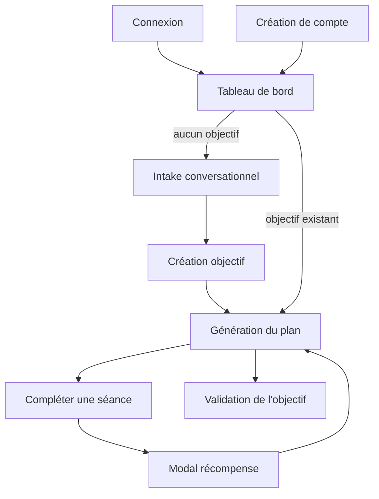

# Wireframes — Coach Course à Pied

Ces wireframes basse fidélité décrivent les quatre écrans clés du parcours utilisateur. Les captures finales doivent être ajoutées dans `docs/img/` après lancement local de l'application.

## 1. Connexion

```text
┌──────────────────────────────────────────────────────────────┐
│ COACH COURSE À PIED                                         │
├──────────────────────────────┬───────────────────────────────┤
│ Définis ton objectif         │ Connexion                     │
│ de course                    │                               │
│                              │ Email                         │
│ 1. Définis ton objectif      │ [________________________]    │
│ 2. Suis ton plan personnalisé│ Mot de passe                  │
│ 3. Gagne de l'XP             │ [________________________]    │
│                              │ [ Se connecter ]              │
│                              │ Créer un compte               │
└──────────────────────────────┴───────────────────────────────┘
```

**Flux de données** : formulaire → `POST /auth/login` → stockage du JWT → redirection vers le tableau de bord.

## 2. Tableau de bord sans objectif — intake

```text
┌──────────────────────────────────────────────────────────────┐
│ Coach / Course à pied              Niveau 1   0 / 100 XP    │
├──────────────────────────────────────────────────────────────┤
│ Crée ton prochain objectif                                   │
│                                                              │
│ Coach : Quelle distance souhaites-tu préparer ?              │
│ Toi   : [_______________________________________________]     │
│                                                              │
│ Historique de conversation                                   │
│ ┌──────────────────────────────────────────────────────────┐ │
│ │ 5 km, 10 km, semi-marathon, marathon...                 │ │
│ └──────────────────────────────────────────────────────────┘ │
│                                             [ Continuer ]     │
└──────────────────────────────────────────────────────────────┘
```

**Flux de données** : TanStack Query charge `GET /domaines` puis `GET /domaines/:id/progression`. Les réponses libres sont envoyées à `POST /ai/objectifs/intake`. Une fois l'intake terminé, le frontend crée l'objectif avec `POST /domaines/:id/objectifs`.

## 3. Tableau de bord avec plan

```text
┌──────────────────────────────────────────────────────────────┐
│ Coach / Course à pied              Niveau 3   84 / 260 XP   │
├──────────────────────────────────────────────────────────────┤
│ Objectif : courir 10 km en moins de 50 minutes               │
│ Progression : ███████████░░░░░  64 %                         │
│                                                              │
│ PLAN D'ENTRAÎNEMENT                                          │
│                                                              │
│ ✓ Séance 1 — Footing facile, 35 min                          │
│ ✓ Séance 2 — Fractionné 8 × 400 m                            │
│ ● Séance 3 — Sortie longue, 60 min       [ Commencer ]       │
│ ○ Séance 4 — Récupération                                    │
│ ○ Séance 5 — Allure objectif                                 │
│                                                              │
│ Prédiction actuelle : 10 km en 52 min 10 s                   │
└──────────────────────────────────────────────────────────────┘
```

**Flux de données** : `GET /domaines/:id/progression` alimente l'objectif, le niveau et les tâches. Si aucune tâche n'existe, `POST /objectifs/:id/taches/generate` crée le plan déterministe.

## 4. Modal de récompense

```text
                 ┌────────────────────────────────┐
                 │ SÉANCE TERMINÉE                │
                 │                                │
                 │          + 96 XP               │
                 │                                │
                 │ Durée       42 min             │
                 │ Distance     7,2 km             │
                 │ Allure       5:50 / km          │
                 │                                │
                 │ Nouvelle prédiction : 50:48    │
                 │                                │
                 │       [ Continuer ]            │
                 └────────────────────────────────┘
```

**Flux de données** : `POST /taches/:id/complete` reçoit les faits de performance, puis le serveur crée la session, calcule l'XP, met à jour la tâche, recalcule la prédiction et renvoie le contenu de la récompense.

## Navigation



## Captures à ajouter

Créer le dossier `docs/img/`, puis ajouter :

- `login.png` ;
- `intake.png` ;
- `dashboard-plan.png` ;
- `reward.png`.

Les images doivent correspondre à l'état final du frontend et ne pas contenir de mot de passe, token ou donnée personnelle réelle.
