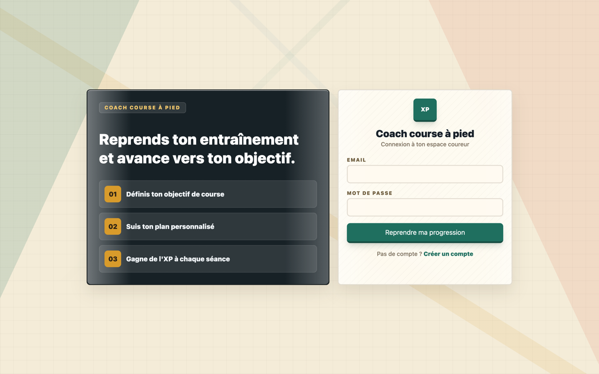
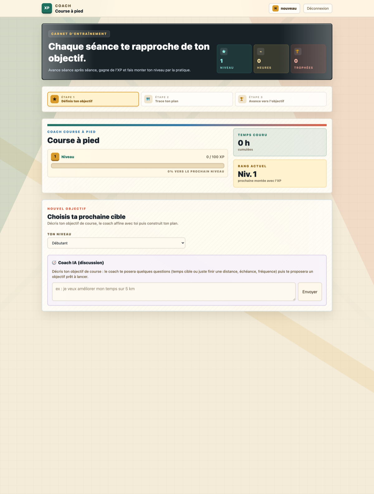
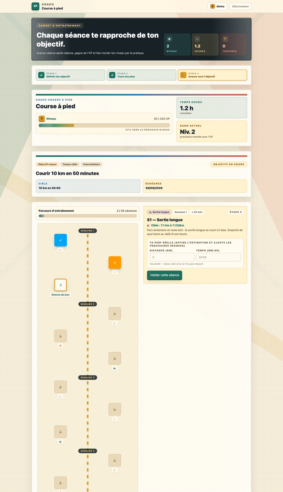
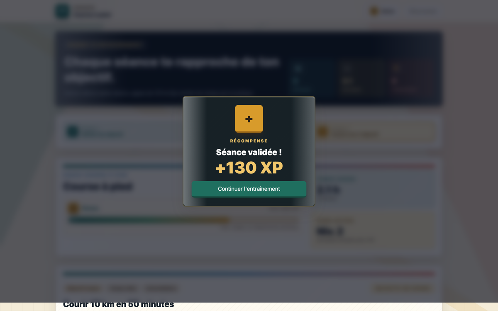

# Wireframes — Coach Course à Pied

Ces wireframes basse fidélité décrivent les quatre écrans clés du parcours utilisateur. Les captures finales doivent être ajoutées dans `docs/img/` après lancement local de l'application.

## 1. Connexion

```text
┌──────────────────────────────────────────────────────────────┐
│ COACH COURSE À PIED                                         │
├──────────────────────────────┬───────────────────────────────┤
│ Définis ton objectif         │ Connexion                     │
│ de course                    │                               │
│                              │ Email                         │
│ 1. Définis ton objectif      │ [________________________]    │
│ 2. Suis ton plan personnalisé│ Mot de passe                  │
│ 3. Gagne de l'XP             │ [________________________]    │
│                              │ [ Se connecter ]              │
│                              │ Créer un compte               │
└──────────────────────────────┴───────────────────────────────┘
```

**Flux de données** : formulaire → `POST /auth/login` → stockage du JWT → redirection vers le tableau de bord.

## 2. Tableau de bord sans objectif — intake

```text
┌──────────────────────────────────────────────────────────────┐
│ Coach / Course à pied              Niveau 1   0 / 100 XP    │
├──────────────────────────────────────────────────────────────┤
│ Crée ton prochain objectif                                   │
│                                                              │
│ Coach : Quelle distance souhaites-tu préparer ?              │
│ Toi   : [_______________________________________________]     │
│                                                              │
│ Historique de conversation                                   │
│ ┌──────────────────────────────────────────────────────────┐ │
│ │ 5 km, 10 km, semi-marathon, marathon...                 │ │
│ └──────────────────────────────────────────────────────────┘ │
│                                             [ Continuer ]     │
└──────────────────────────────────────────────────────────────┘
```

**Flux de données** : TanStack Query charge `GET /domaines` puis `GET /domaines/:id/progression`. Les réponses libres sont envoyées à `POST /ai/objectifs/intake`. Une fois l'intake terminé, le frontend crée l'objectif avec `POST /domaines/:id/objectifs`.

## 3. Tableau de bord avec plan

```text
┌──────────────────────────────────────────────────────────────┐
│ Coach / Course à pied              Niveau 3   84 / 260 XP   │
├──────────────────────────────────────────────────────────────┤
│ Objectif : courir 10 km en moins de 50 minutes               │
│ Progression : ███████████░░░░░  64 %                         │
│                                                              │
│ PLAN D'ENTRAÎNEMENT                                          │
│                                                              │
│ ✓ Séance 1 — Footing facile, 35 min                          │
│ ✓ Séance 2 — Fractionné 8 × 400 m                            │
│ ● Séance 3 — Sortie longue, 60 min       [ Commencer ]       │
│ ○ Séance 4 — Récupération                                    │
│ ○ Séance 5 — Allure objectif                                 │
│                                                              │
│ Prédiction actuelle : 10 km en 52 min 10 s                   │
└──────────────────────────────────────────────────────────────┘
```

**Flux de données** : `GET /domaines/:id/progression` alimente l'objectif, le niveau et les tâches. Si aucune tâche n'existe, `POST /objectifs/:id/taches/generate` crée le plan déterministe.

## 4. Modal de récompense

```text
                 ┌────────────────────────────────┐
                 │ SÉANCE TERMINÉE                │
                 │                                │
                 │          + 96 XP               │
                 │                                │
                 │ Durée       42 min             │
                 │ Distance     7,2 km             │
                 │ Allure       5:50 / km          │
                 │                                │
                 │ Nouvelle prédiction : 50:48    │
                 │                                │
                 │       [ Continuer ]            │
                 └────────────────────────────────┘
```

**Flux de données** : `POST /taches/:id/complete` reçoit les faits de performance, puis le serveur crée la session, calcule l'XP, met à jour la tâche, recalcule la prédiction et renvoie le contenu de la récompense.

## Navigation

```mermaid
<<<<<<< HEAD
flowchart LR
  L["/login"] <--> R["/register"]
  L -->|"JWT stocké"| D["/ (protégée)"]
  R -->|"auto-login"| D
  D -->|"pas d'objectif actif"| I["Intake coach IA"]
  D -->|"objectif + plan"| P["Parcours d'entraînement"]
  P -->|"séance validée"| M["Modal récompense XP"]
```

Une seule page authentifiée : le tableau de bord (`CoursePage`) affiche soit la création
d'objectif (intake), soit le plan d'entraînement, selon l'état du coureur.

## 1. Login

```text
┌─────────────────────────────────┬───────────────────────┐
│ [COACH COURSE À PIED]           │        (XP)           │
│                                 │  Coach course à pied  │
│  Reprends ton entraînement      │  ─────────────────    │
│  et avance vers ton objectif.   │  Email    [________]  │
│                                 │  Mot de p [________]  │
│  01 Définis ton objectif        │                       │
│  02 Suis ton plan personnalisé  │  [ Se connecter ]     │
│  03 Gagne de l'XP à chaque      │                       │
│     séance                      │  Pas de compte ?      │
│                                 │  → Créer un compte    │
└─────────────────────────────────┴───────────────────────┘
```



**Flux de données** : `POST /auth/login` → `{ user, token }` stocké en `localStorage`
(`se_token`, `se_user`) → redirection `/`.

## 2. Création d'objectif — intake coach IA

```text
┌──────────────────────────────────────────────────────────┐
│ HUD : Niveau · Heures · Trophées   Étapes ①②③            │
├──────────────────────────────────────────────────────────┤
│ NOUVEL OBJECTIF — Choisis ta prochaine cible             │
│ Ton niveau : (débutant) (intermédiaire) (avancé)         │
│ ┌──────────────────────────────────────────────────────┐ │
│ │ 💬 user  : « courir un 10 km en 50 min fin août »    │ │
│ │ 💬 coach : « Quel est ton chrono actuel sur 10 km ? »│ │
│ │ … (≤ 4 questions) …                                  │ │
│ │ ▣ Proposition : titre + cible + échéance + badge     │ │
│ │   [ Lancer cet objectif ]                            │ │
│ └──────────────────────────────────────────────────────┘ │
│ [ zone de saisie ______________________ ] [ Envoyer ]    │
└──────────────────────────────────────────────────────────┘
```



**Flux de données** : chaque tour de chat → `POST /ai/objectifs/intake { niveau, messages }`
(mutation TanStack Query, loader « Le coach réfléchit… »). Quand `done=true`, la proposition
s'affiche → `POST /domaines/:id/objectifs` → invalidation de la query `progression`.

## 3. Tableau de bord — plan d'entraînement

```text
┌──────────────────────────────────────────────────────────┐
│ HUD : Niveau 2 · 1.2 h · 0 trophées   Étapes ✓✓③         │
│ Barre XP : 82 / 303 XP (27 %)                            │
├──────────────────────────────────────────────────────────┤
│ Objectif : « Courir 10 km en 50 minutes »                │
│ Cible 10 km en 50:00 · Échéance 30/09/2026               │
├────────────────────────────┬─────────────────────────────┤
│ Parcours d'entraînement    │ Détail séance sélectionnée  │
│ 2 / 35 séances             │ S1 — Sortie longue          │
│  SEMAINE 1                 │ Cible : 7.1 km à 7:23/km    │
│   [✓]──[✓]──[3]← du jour   │ Conseil du coach…           │
│  SEMAINE 2                 │ Perf réelle : [km] [mm:ss]  │
│   [🔒]──[🔒]──[🔒]          │ [ Valider cette séance ]    │
│  … → 🏁 Arrivée            │                             │
└────────────────────────────┴─────────────────────────────┘
```



**Flux de données** : query `GET /domaines/:id/progression` (domaine + objectif actif + séances +
sessions). Génération du plan : `POST /objectifs/:id/taches/generate` (déterministe, zéro LLM).
Les séances verrouillées 🔒 se débloquent dans l'ordre.

## 4. Récompense (après validation d'une séance)

```text
┌──────────────────────────────┐
│          [ + ]               │
│        RÉCOMPENSE            │
│      Séance validée !        │
│         +62 XP               │
│  Estimation actuelle : …     │
│ [ Continuer l'entraînement ] │
└──────────────────────────────┘
```



**Flux de données** : `POST /taches/:id/complete { durée, perf réelle ? }` → transaction serveur
(session + XP + niveau + prédiction Riegel + recalibrage des séances restantes) → réponse
`{ xpEarned, leveledUp, prediction }` affichée dans le modal → invalidation de `progression`.
=======
flowchart TD
    LOGIN[Connexion] --> DASH[Tableau de bord]
    REGISTER[Création de compte] --> DASH
    DASH -->|aucun objectif| INTAKE[Intake conversationnel]
    INTAKE --> CREATE[Création objectif]
    CREATE --> PLAN[Génération du plan]
    DASH -->|objectif existant| PLAN
    PLAN --> SESSION[Compléter une séance]
    SESSION --> REWARD[Modal récompense]
    REWARD --> PLAN
    PLAN --> VALIDATE[Validation de l'objectif]
```

## Captures à ajouter

Créer le dossier `docs/img/`, puis ajouter :

- `login.png` ;
- `intake.png` ;
- `dashboard-plan.png` ;
- `reward.png`.

Les images doivent correspondre à l'état final du frontend et ne pas contenir de mot de passe, token ou donnée personnelle réelle.
>>>>>>> origin/docs/phases-4-8-coach-running
